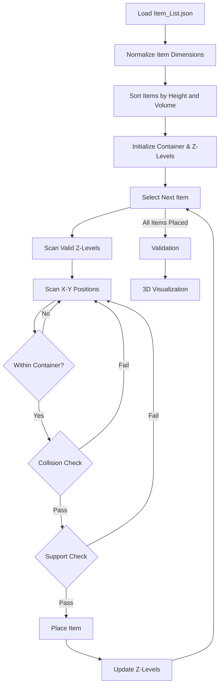

# **3D-Spatial-Packing-System**
A gravity-aware 3D spatial packing system that places multiple cuboid items inside a fixed-size container using deterministic heuristics. It ensures non-overlap, physical support, boundary compliance, and visually validates correctness through 3D rendering.


---

# **Table of Contents**

1. [Overview](#overview)
2. [Features](#features)
3. [Folder Structure](#folder-structure)
4. [How to Run Locally](#how-to-run-locally)
5. [Flow & Design Decisions](#flow--design-decisions)
6. [Mermaid Flow Diagram](#flow--design-decisions)
7. [Packing Strategy & Placement Logic](#packing-strategy--placement-logic)
8. [Validation & Correctness](#validation--correctness)
9. [Visualization](#visualization)
10. [Challenges & Trade-Offs](#challenges--trade-offs)
---

# **Overview**

This project implements a **3D spatial packing system** that places a set of cuboid items inside a fixed-size container (`100 × 100 × 100`).
The system respects **gravity**, prevents **collisions**, avoids **floating objects**, and ensures all items remain within container boundaries.

The solution follows a **deterministic, rule-based approach** rather than probabilistic or ML-based optimization, making it transparent, explainable, and easy to validate.

---

# **Features**

* Gravity-aware 3D placement
* Collision-free packing using AABB checks
* Deterministic heuristic-based strategy
* Layer-by-layer spatial placement
* Full boundary validation
* 3D visualization for proof of correctness

---

# **Folder Structure**

```
part2/
│
├── data/
│   └── Item_List.json
│
├── main.py
└── README.md
```

---

# **How to Run Locally**

### **1. Install Dependencies**

```bash
pip install open3d numpy
```

### **2. Run the Program**

```bash
python3 main.py
```

The script will:

* Load item data
* Compute valid placements
* Validate constraints
* Launch a 3D visualization window

---

# **Flow & Design Decisions**

The system is designed around **physical correctness first**, followed by reasonable space utilization.

### **Key Design Choices**

* Deterministic heuristics over optimization algorithms
* Height-aware item ordering to prevent future blockage
* Gravity enforced via support checks
* Simple, explainable placement rules

This ensures the system remains **debuggable, extensible, and verifiable**.

---

## **Mermaid Flow Diagram**



---

# **Packing Strategy & Placement Logic**

### **Strategy**

* Items are sorted primarily by **height**, then by **volume**
* Taller items are placed earlier to avoid blocking future layers
* Smaller items naturally fill remaining gaps

### **Placement Logic**

For each item:

1. Iterate over valid Z-levels
2. Scan X–Y positions within container bounds
3. Check collision using AABB logic
4. Verify gravity support
5. Place item and update environment state

---

# **Validation & Correctness**

After placement:

* Confirms all items are placed
* Ensures no item exceeds container limits
* Computes maximum height used
* Asserts physical validity

Example output:

```
Total boxes placed: 20 / 20
Maximum height used: 60 / 100
Packing validation successful
```

---

# **Visualization**

The final packing result is visualized using **Open3D**:

* Container rendered as a wireframe cube
* Each item rendered as a colored cuboid
* Allows camera rotation and zoom
* Serves as **visual proof of correctness**

---

# **Challenges & Trade-Offs**

* Packing is **not globally optimal** (NP-hard problem)
* Heuristic prioritizes correctness over maximal density
* Deterministic approach chosen for clarity and explainability

---


